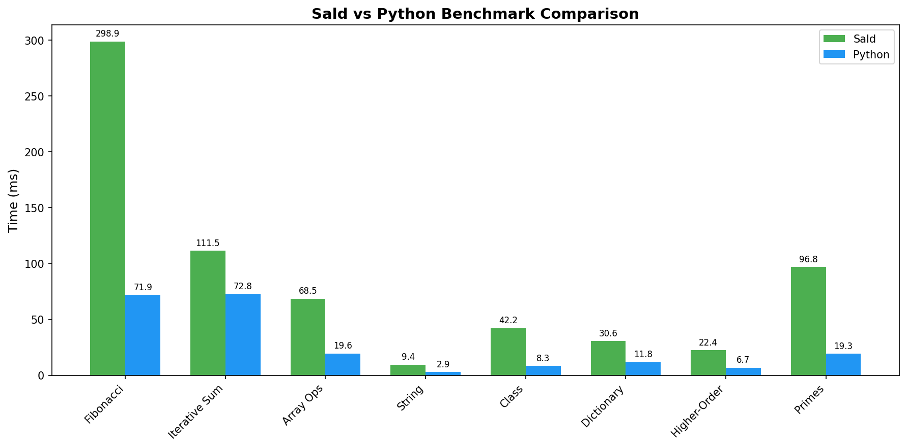

<p align="center">
  
</p>

<h1 align="center">Sald</h1>

<p align="center">
  <strong>⚠️ NOTE: This project is no longer maintained.</strong>
</p>

<p align="center">
  A modern dynamic programming language built with Rust.
</p>

<p align="center">
  <a href="https://starssxhfdmh.github.io/sald-docs/">Documentation</a> •
  <a href="https://saladpm.vercel.app">Package Manager</a> •
  <a href="https://starssxhfdmh.github.io/sald-playground">Playground</a>
</p>

---

## 🛑 Project Status: Unmaintained

> [!CAUTION]
> **This project is no longer being developed or maintained.** This code remains available for reference or archive purposes, but there will be no future feature updates, bug fixes, or pull request reviews.

---

## Features

- Class-based OOP with inheritance
- Async/await for asynchronous programming
- Rich standard library (File, Http, Json, System, Process, etc.)
- Package manager (`salad`)
- Language server (`sald-lsp`)
- Interactive REPL

## Installation

### Quick Install

**Linux:**
```bash
curl -fsSL [https://raw.githubusercontent.com/starssxhfdmh/sald/master/install.sh](https://raw.githubusercontent.com/starssxhfdmh/sald/master/install.sh) | bash

```

**Windows:**

```powershell
irm [https://raw.githubusercontent.com/starssxhfdmh/sald/master/install.ps1](https://raw.githubusercontent.com/starssxhfdmh/sald/master/install.ps1) | iex

```

### Build from Source

```bash
git clone [https://github.com/starssxhfdmh/sald.git](https://github.com/starssxhfdmh/sald.git)
cd sald && cargo build --release

```

## Quick Start

```bash
# Run a script
sald script.sald

# Start REPL
sald

# Create new project
salad new my-project

```

## Example

```sald
class Greeter {
    fun init(self, name) {
        self.name = name
    }

    fun greet(self) {
        Console.println($"Hello, {self.name}!")
    }
}

let g = Greeter("World")
g.greet()

```

## Benchmarks

<p align="center">

</p>

<p align="center">
<em>Sald vs Python performance comparison</em>
</p>

## Resources

* [Documentation](https://starssxhfdmh.github.io/sald-docs/) — Complete language reference
* [Package Manager](https://saladpm.vercel.app) — Browse and publish packages
* [Playground](https://starssxhfdmh.github.io/sald-playground) — Try Sald in your browser

## License

MIT License


Apakah Anda ingin saya mengubah bahasanya menjadi full Inggris agar seragam dengan konten lainnya, atau tetap ada penjelasan bahasa Indonesianya?

```
